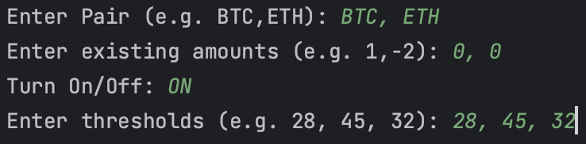
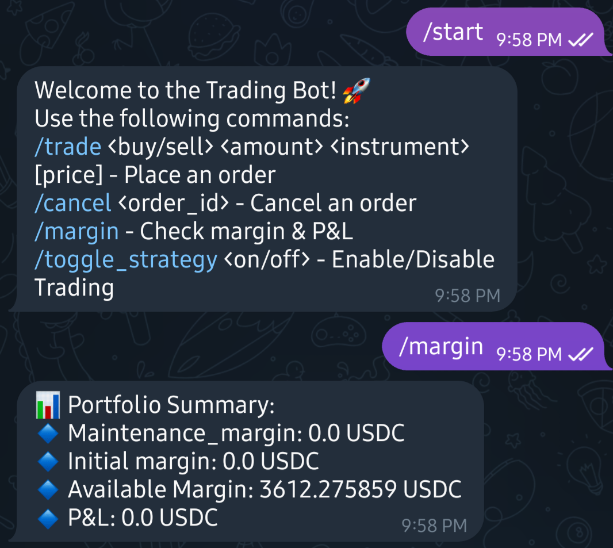
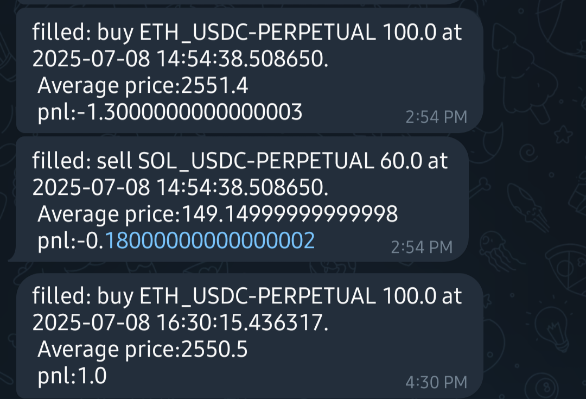

# KF_HMM_PairTrading_Deribit

**Algorithmic pair trading strategy powered by Kalman Filter and Hidden Markov Models (HMM)**, featuring both historical backtesting and a real-time trading system with Telegram bot integration for monitoring and manual control.

---

## 📋 Table of Contents
1. [Overview](#overview)  
2. [Premises](#premises)  
3. [Setup Instructions](#setup-instructions)  
4. [Running Backtests](#running-backtests)  
5. [Running the Real-Time Algorithm](#running-the-real-time-algorithm)  
6. [Telegram Bot Integration](#telegram-bot-integration)  
7. [Flowchart](#flowchart)  
8. [Strategy Details](#strategy-details)  
9. [References](#references)  

---

## 📌 Overview
This project implements a **statistical arbitrage** strategy that:
- Selects crypto asset pairs (BTC, ETH, SOL, XRP)  
- Estimates **time-varying hedge ratios** with a Kalman Filter  
- Uses **HMM** to classify market regimes  
- Generates trading signals based on **regime-dependent thresholds**  
- Runs in **real time** via Deribit WebSocket API  
- Integrates with a **Telegram bot** for monitoring and manual control

---

## 🛠 Premises
1. **Dependencies:** Install packages listed in `requirements.txt`.
2. **Keys Folder:**  
   - Create a folder named `key/`.  
   - Store authentication keys for **Deribit** and **Telegram** inside.  
   - You can use `generate_key.py` to generate RSA keys.
3. **Database Setup:**  
   - Execute `create_table.sql` to create prerequisite tables.
4. **Backtesting Environment:**  
   - Use Jupyter Notebook for offline simulations.
5. **Real-Time Trading:**  
   - Run `websocket_client_pair.py` to enable live trading.

---

## 🚀 Setup Instructions
1. **Install Dependencies**
   ```bash
   pip install -r requirements.txt
   ```
2. **Generate Keys**
   ```bash
   python generate_key.py
   ```
   Store the generated keys and API credentials in the `key/` folder.

3. **Create Database Tables**
   ```bash
   mysql -u <username> -p <database_name> < create_table.sql
   ```

---

## 📊 Running Backtests
1. Open **Jupyter Notebook**:
   ```bash
   jupyter notebook
   ```
2. Run:
   - `KF_HMM_Backtesting.ipynb`  
   - Adjust signal thresholds based on backtest results.

---

## ⚡ Running the Real-Time Algorithm
Run:
```bash
python websocket_client_pair.py
```
You will be prompted to input:

- **Enter Pair:** Pair from {`BTC`, `ETH`, `SOL`, `XRP`}  
- **Enter existing amounts:** Current perpetual futures positions you hold  
- **Turn On/Off:** Enable (`ON`) or disable (`OFF`) trading mode  
- **Enter thresholds:** Regime-dependent signal thresholds.  
  - The first value is for the least volatile regime.  
  - These should be decided via backtesting.

**Example Run:**  


---

## 📱 Telegram Bot Integration
**Premise:**  
- Create your own Telegram bot via [BotFather](https://core.telegram.org/bots#botfather).  
- Obtain your `bot_token` and `chat_id`.  
- Save them in the `key/` folder.

**Features:**
1. Request account info: `/margin`  
2. Manual control commands: `/start`, `/trade`, `/cancel`, `/toggle_strategy`  
3. Real-time trade notifications when orders are executed.

**Example Screenshots:**  
  
  

---

## 📈 Strategy Details
- **Kalman Filter** estimates dynamic hedge ratios between coin pairs.  
- **HMM** classifies market regimes based on innovation volatility and return features.  
- **DDIVF** (Directional Deviation Innovation Volatility Forecasting) adjusts position sizing.  
- Strategy uses regime-specific thresholds to enter/exit trades.  

---

## 📚 References
1. [Statistical Arbitrage 1: Pairs Trading with Robust Kalman Filter and Hidden Markov Model – Medium](https://medium.com/@kaichong.wang/statistical-arbitrage-1-pairs-trading-with-robust-kalman-filter-and-hidden-markov-model-62d0a1a0e4ae)  

---
